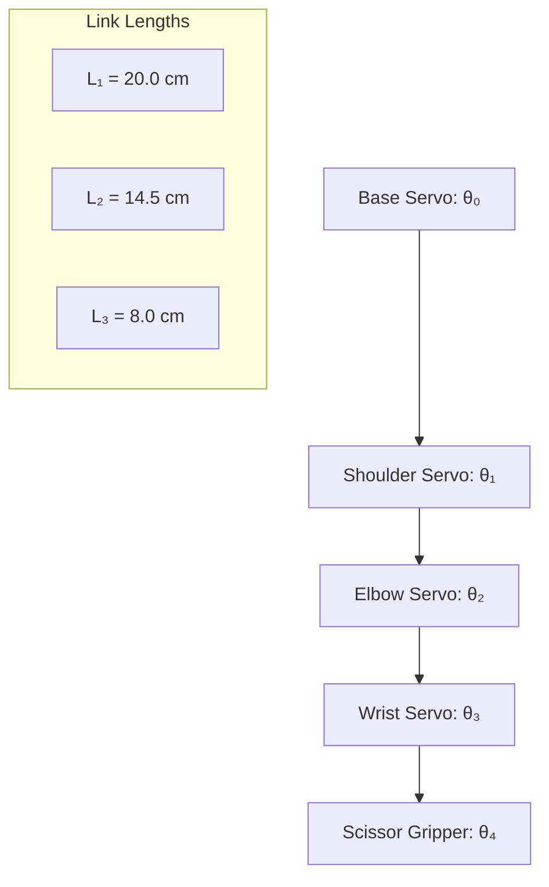

# Strawberry Picker Arduino Code

This directory contains the Arduino control code for the 5-DOF strawberry picking robotic arm.

## Overview

The robotic arm uses:
- **5 servos** controlled via I2C PWM driver (Adafruit_PWMServoDriver)
- **Forward kinematics** for position calculation
- **Inverse kinematics** for position control
- **Lagrangian dynamics** for gravity compensation and computed torque control

## Hardware Requirements

- Arduino Uno or compatible board
- Adafruit 16-Channel 12-bit PWM/Servo Driver
- 5x Servo motors (MG996R or similar)
- Power supply (5V 2A minimum)
- I2C wiring (SDA/SCL)

## Arm Configuration



## Directory Structure

```
ArduinoCode/
├── README.md                          # This file
├── Lagrangian_Dynamics.md            # Complete dynamics derivation
├── forward_kinematics/               # Forward kinematics implementation
│   ├── platformio.ini               # PlatformIO configuration
│   └── src/
│       └── main.cpp                 # Forward kinematics code
├── inverse_kinematics/               # Inverse kinematics implementation
│   ├── platformio.ini               # PlatformIO configuration
│   └── src/
│       └── main.cpp                 # Inverse kinematics code
└── docs/                            # Documentation
    ├── analysis.md                  # Kinematic analysis
    ├── implementation_plan.md       # Implementation strategy
    ├── implementation_summary.md    # Summary of approach
    └── test_cases.md               # Test scenarios
```

## Quick Start

### Forward Kinematics
Calculates end-effector position (x, y, z) from joint angles.

**Usage:**
```bash
cd forward_kinematics
pio run --target upload
```

**Serial Commands:**
- Enter: `theta0 theta1 theta2`
- Example: `90 135 90`
- Returns: Computed (x, y, z) position

### Inverse Kinematics
Calculates joint angles from desired end-effector position.

**Usage:**
```bash
cd inverse_kinematics
pio run --target upload
```

**Serial Commands:**
- `I x y z` - Inverse kinematics mode
- `F t0 t1 t2` - Forward kinematics mode
- Example: `I 15 20 10`

## Dynamics Integration

See [Lagrangian_Dynamics.md](Lagrangian_Dynamics.md) for:
- Complete Lagrangian derivation
- Gravity compensation equations
- Computed torque control implementation
- Parameter measurement guide

### Key Dynamic Equations

**Gravity Compensation (Essential):**
```cpp
// Shoulder joint gravity compensation
G₁ = m₁g(L₁/2)cos(θ₁) 
     + m₂g[L₁cos(θ₁) + (L₂/2)cos(θ₁+θ₂)]
     + m₃g[L₁cos(θ₁) + L₂cos(θ₁+θ₂) + (L₃/2)cos(θ₁+θ₂+θ₃)]
```

**Mass Matrix (for acceleration control):**
```cpp
M₁₁ = I₁y + m₁L₁²/4 + I₂y + m₂(L₁² + L₂²/4 + L₁L₂cos(θ₂))
```

## Parameter Measurement

Critical parameters to measure for your specific arm:

| Parameter | Symbol | How to Measure | Typical Value |
|-----------|--------|----------------|---------------|
| Link 1 mass | m₁ | Weigh on scale | 0.10-0.20 kg |
| Link 2 mass | m₂ | Weigh on scale | 0.08-0.15 kg |
| Link 3 mass | m₃ | Weigh on scale | 0.05-0.10 kg |
| Link lengths | L₁, L₂, L₃ | Measure/CAD | 0.20, 0.145, 0.08 m |
| Inertias | I₁y, I₂y, I₃y | Pendulum test | 0.0001-0.001 kg·m² |

See [Lagrangian_Dynamics.md](Lagrangian_Dynamics.md) for detailed measurement procedures.

## Control Modes

### 1. Position Control (Current)
- Uses inverse kinematics
- No dynamics compensation
- Simple but less accurate

### 2. Gravity Compensation (Recommended)
- Compensates for gravitational forces
- Prevents arm sagging
- Reduces servo load

### 3. Computed Torque Control (Advanced)
- Full dynamics model
- Accurate trajectory tracking
- Handles varying payloads

## Troubleshooting

**Arm sagging when stationary:**
- Implement gravity compensation from Lagrangian_Dynamics.md
- Tune gravity compensation parameters

**Inaccurate positioning:**
- Verify link length measurements
- Check servo calibration (pulse width to angle mapping)
- Implement dynamics compensation

**Jerky motion:**
- Increase interpolation steps in `moveToTargetAngles()`
- Reduce maximum velocity
- Add velocity profiling

## References

- [Lagrangian_Dynamics.md](Lagrangian_Dynamics.md) - Complete dynamics derivation
- [PlatformIO Documentation](https://docs.platformio.org/)
- [Adafruit PWM Servo Driver Library](https://github.com/adafruit/Adafruit-PWM-Servo-Driver-Library)

## License

Same as main strawberryPicker project (MIT License)