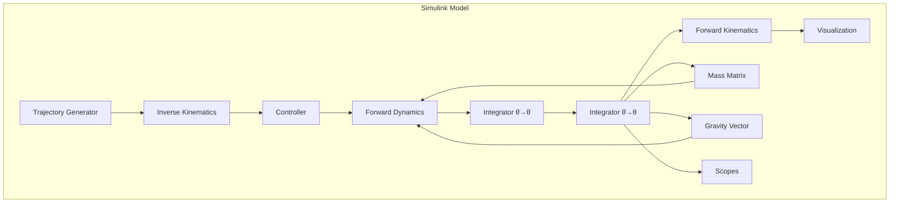

# MATLAB Simulink Simulation for Strawberry Picker Robotic Arm

## Overview

This document provides a complete guide for creating a MATLAB Simulink simulation of the 5-DOF strawberry picker robotic arm. The simulation includes kinematics, dynamics, control systems, and visualization to validate the Lagrangian dynamics and test control algorithms before Arduino deployment.

## Project Structure

```
strawberryPicker_Simulink/
├── main_simulation.slx                      # Top-level Simulink model
├── parameters.m                            # Robot parameters
├── kinematics/                             # Kinematic functions
│   ├── forward_kinematics.m               # FK calculations
│   └── inverse_kinematics.m               # IK calculations
├── dynamics/                               # Dynamic model
│   ├── mass_matrix.m                      # M(θ) calculation
│   ├── coriolis_matrix.m                  # C(θ, θ̇) calculation
│   ├── gravity_vector.m                   # G(θ) calculation
│   └── forward_dynamics.m                 # Equations of motion
├── controllers/                            # Control systems
│   ├── pid_controller.slx                 # PID control blocks
│   └── computed_torque.m                  # Computed torque control
├── trajectories/                           # Motion planning
│   ├── pick_trajectory.m                  # Picking motion generator
│   └── path_planner.m                     # Path planning
├── visualization/                          # Visualization
│   ├── robot_visualization.m              # 3D robot visualization
│   └── animate_robot.m                    # Animation function
└── validation/                             # Validation scripts
    ├── validate_kinematics.m              # FK/IK validation
    ├── validate_dynamics.m                # Dynamics validation
    └── compare_with_arduino.m             # Arduino code comparison
```

## Prerequisites

- MATLAB R2020b or later
- Simulink
- Robotics Toolbox (optional but recommended)
- Simscape Multibody (optional for 3D mechanics)

## Step 1: Parameter Configuration

Create `parameters.m` to define all robot parameters:

```matlab
% parameters.m - Strawberry Picker Robot Parameters

%% Link Dimensions (from Arduino code)
L1 = 0.20;      % Link 1 length: 20 cm
L2 = 0.145;     % Link 2 length: 14.5 cm
L3 = 0.08;      % Link 3 length: 8 cm

%% Masses (MEASURE THESE FOR YOUR ROBOT)
m1 = 0.15;      % Link 1 mass: 150g
m2 = 0.12;      % Link 2 mass: 120g
m3 = 0.08;      % Link 3 mass: 80g
m4 = 0.05;      % Gripper mass: 50g

%% Center of Mass positions (from joint axes)
r1 = L1/2;      % Link 1 COM
r2 = L2/2;      % Link 2 COM
r3 = L3/2;      % Link 3 COM

%% Moments of Inertia (MEASURE OR ESTIMATE)
I1y = 0.0005;   % Link 1 inertia about y-axis
I2y = 0.0003;   % Link 2 inertia about y-axis
I3y = 0.0002;   % Link 3 inertia about y-axis

%% Gravity
g = 9.81;       % m/s²

%% Servo Limits
theta_min = [0, 0, 0, 0, 0];        % Minimum angles (deg)
theta_max = [180, 180, 180, 180, 90]; % Maximum angles (deg)

%% Simulation Parameters
dt = 0.001;     % Simulation timestep (1ms)
t_final = 10;   % Simulation duration (s)

%% Initial Conditions
theta0 = [90, 95, 80, 90, 0];       % Initial joint angles (deg)
theta_dot0 = [0, 0, 0, 0, 0];       % Initial velocities (deg/s)

%% Control Parameters
Kp = diag([0.5, 0.8, 0.6, 0.4, 0.3]);  % Proportional gains
Kd = diag([0.1, 0.15, 0.12, 0.08, 0.05]); % Derivative gains
```

## Step 2: Kinematic Model

### Forward Kinematics (`kinematics/forward_kinematics.m`)

```matlab
function [x, y, z] = forward_kinematics(theta)
% FORWARD_KINEMATICS - Calculate end-effector position from joint angles
%   theta: [5x1] vector of joint angles [theta0, theta1, theta2, theta3, theta4] in degrees
%   Returns: [x, y, z] end-effector position in meters

% Load parameters
params = load('parameters.m');
L1 = params.L1; L2 = params.L2; L3 = params.L3;

% Convert to radians
t0 = deg2rad(theta(1));
t1 = deg2rad(theta(2));
t2 = deg2rad(theta(3) - theta(2));  % Relative angle
t3 = deg2rad(theta(4));

% Calculate arm position in vertical plane
y_arm = L1*cos(t1) + L2*cos(t2) + L3;
z_arm = L1*sin(t1) - L2*sin(t2);

% Rotate by base angle
x = y_arm * cos(t0);
y = y_arm * sin(t0);
z = z_arm;
end
```

### Inverse Kinematics (`kinematics/inverse_kinematics.m`)

```matlab
function [theta, success] = inverse_kinematics(x, y, z)
% INVERSE_KINEMATICS - Calculate joint angles from end-effector position
%   [x, y, z]: Desired end-effector position in meters
%   Returns: theta [5x1] joint angles in degrees, success flag

params = load('parameters.m');
L1 = params.L1; L2 = params.L2; L3 = params.L3;

% Base angle
theta0 = atan2(y, x);

% Arm length in xy-plane
arm_length = sqrt(x^2 + y^2) - L3;

% Check reachability
C = sqrt(arm_length^2 + z^2);
if C > (L1 + L2) || C < abs(L1 - L2)
    theta = zeros(5, 1);
    success = false;
    return
end

% Solve for joint angles using geometric method
a = L1; b = L2;
cos_theta2 = (a^2 + b^2 - C^2) / (2*a*b);
cos_theta2 = max(-1, min(1, cos_theta2));  % Clamp to [-1, 1]
theta2_rel = acos(cos_theta2);

% Shoulder angle
if arm_length > 0
    shoulder_right = atan(z / arm_length);
    cos_shoulder = (a^2 + C^2 - b^2) / (2*a*C);
    cos_shoulder = max(-1, min(1, cos_shoulder));
    shoulder_trig = acos(cos_shoulder);
    theta1 = shoulder_trig + shoulder_right;
else
    % Special case: arm_length = 0
    cos_shoulder = (a^2 + C^2 - b^2) / (2*a*C);
    cos_shoulder = max(-1, min(1, cos_shoulder));
    shoulder_trig = acos(cos_shoulder);
    theta1 = shoulder_trig + pi/2;
end

% Elbow angle (absolute)
theta2 = theta1 + theta2_rel;

% Wrist angle (maintain orientation)
theta3 = theta2 - (80 - rad2deg(theta2)) * 2;

% Gripper angle
theta4 = 0;  % Default open

theta = [rad2deg(theta0), rad2deg(theta1), rad2deg(theta2), theta3, theta4];
success = true;
end
```

## Step 3: Dynamic Model

### Mass Matrix (`dynamics/mass_matrix.m`)

```matlab
function M = mass_matrix(theta)
% MASS_MATRIX - Compute mass matrix M(θ) for 5-DOF arm
%   theta: [5x1] joint angles in degrees

params = load('parameters.m');
m1 = params.m1; m2 = params.m2; m3 = params.m3;
L1 = params.L1; L2 = params.L2; L3 = params.L3;
I1y = params.I1y; I2y = params.I2y; I3y = params.I3y;

% Convert to radians
t1 = deg2rad(theta(2));
t2 = deg2rad(theta(3) - theta(2));

% Initialize 5x5 matrix
M = zeros(5, 5);

% Simplified diagonal elements (most important)
M(1,1) = I1y + m1*L1^2/4 + I2y + m2*(L1^2 + L2^2/4 + L1*L2*cos(t2));
M(2,2) = I2y + m2*L2^2/4 + I3y + m3*(L2^2 + L3^2/4 + L2*L3*cos(t2));
M(3,3) = I3y + m3*L3^2/4;
M(4,4) = 0.001;  % Wrist small inertia
M(5,5) = 0.0005; % Gripper small inertia

% Off-diagonal coupling terms
M(1,2) = m2*L1*L2*cos(t2)/2 + m3*L1*L2*cos(t2);
M(2,1) = M(1,2);

% Add base rotation inertia (simplified)
M(0,0) = 0.01;  % Base inertia
end
```

### Gravity Vector (`dynamics/gravity_vector.m`)

```matlab
function G = gravity_vector(theta)
% GRAVITY_VECTOR - Compute gravity compensation terms
%   theta: [5x1] joint angles in degrees

params = load('parameters.m');
m1 = params.m1; m2 = params.m2; m3 = params.m3; m4 = params.m4;
L1 = params.L1; L2 = params.L2; L3 = params.L3;
g = params.g;

% Convert to radians
t1 = deg2rad(theta(2));
t2 = deg2rad(theta(3));
t3 = deg2rad(theta(4));

% Gravity terms for each joint
G = zeros(5, 1);

% Shoulder joint (most affected by gravity)
G(2) = m1*g*L1/2*cos(t1) ...
     + m2*g*(L1*cos(t1) + L2/2*cos(t2)) ...
     + m3*g*(L1*cos(t1) + L2*cos(t2) + L3/2*cos(t3)) ...
     + m4*g*(L1*cos(t1) + L2*cos(t2) + L3*cos(t3));

% Elbow joint
G(3) = m2*g*L2/2*cos(t2) ...
     + m3*g*(L2*cos(t2) + L3/2*cos(t3)) ...
     + m4*g*(L2*cos(t2) + L3*cos(t3));

% Wrist joint
G(4) = m3*g*L3/2*cos(t3) + m4*g*L3*cos(t3);

% Base and gripper have minimal gravity effect
G(1) = 0;
G(5) = 0;
end
```

### Forward Dynamics (`dynamics/forward_dynamics.m`)

```matlab
function theta_ddot = forward_dynamics(theta, theta_dot, tau)
% FORWARD_DYNAMICS - Compute joint accelerations from torques
%   theta: [5x1] joint angles (deg)
%   theta_dot: [5x1] joint velocities (deg/s)
%   tau: [5x1] joint torques (N·m)

% Convert velocities to rad/s for calculations
theta_dot_rad = deg2rad(theta_dot);

% Compute dynamics matrices
M = mass_matrix(theta);
C = coriolis_matrix(theta, theta_dot);
G = gravity_vector(theta);

% Solve: M*θ̈ + C*θ̇ + G = τ
theta_ddot_rad = M \ (tau - C*theta_dot_rad - G);

% Convert back to deg/s²
theta_ddot = rad2deg(theta_ddot_rad);
end
```

## Step 4: Simulink Model Setup

### Top-Level Model (`main_simulation.slx`)

1. **Create new Simulink model**
2. **Add these key blocks:**

```
[Trajectory Generator] → [Inverse Kinematics] → [Controller]
    ↑                                                      ↓
[Forward Kinematics] ← [Robot Plant] ← [Forward Dynamics]
    ↓
[Visualization] → [Scopes/Displays]
```

### Key Block Configurations:

**MATLAB Function Blocks:**
- Set "MATLAB Function" block for each kinematic/dynamic function
- Configure input/output sizes
- Add parameters as block arguments

**Integrator Blocks:**
- Add three integrators in series: θ̈ → θ̇ → θ
- Set initial conditions from parameters.m

**PID Controller Blocks:**
- Add PID block for each joint (5 total)
- Configure gains from Kp, Kd matrices

**Scope Blocks:**
- Joint angles (5 signals)
- Joint torques (5 signals)
- End-effector position (3 signals)
- Tracking errors (5 signals)

## Step 5: Trajectory Generation

### Pick Trajectory (`trajectories/pick_trajectory.m`)

```matlab
function [q, qd, qdd] = pick_trajectory(t)
% PICK_TRAJECTORY - Generate strawberry picking trajectory
%   t: Current time (s)
%   Returns: q (pos), qd (vel), qdd (acc) for all joints

% Define via points (in degrees)
q0 = [90, 95, 80, 90, 0];  % Home position
q1 = [90, 120, 60, 80, 0]; % Approach
q2 = [90, 125, 55, 75, 0]; % Pre-pick
q3 = [90, 125, 55, 75, 45];% Pick (close gripper)
q4 = [90, 120, 60, 80, 45];% Retreat
q5 = [90, 95, 80, 90, 0];  % Return home

% Time segments (seconds)
t_segments = [0, 2, 3, 4, 5, 7];

% Find current segment
for i = 1:length(t_segments)-1
    if t >= t_segments(i) && t < t_segments(i+1)
        segment = i;
        t_rel = t - t_segments(i);
        T = t_segments(i+1) - t_segments(i);
        break
    end
end

% 5th order polynomial interpolation for smooth trajectory
if exist('segment', 'var')
    q_start = eval(['q' num2str(segment-1)]);
    q_end = eval(['q' num2str(segment)]);
    
    % Polynomial coefficients for minimum jerk
    a0 = q_start;
    a1 = zeros(5, 1);
    a2 = zeros(5, 1);
    a3 = 10*(q_end - q_start)/T^3;
    a4 = -15*(q_end - q_start)/T^4;
    a5 = 6*(q_end - q_start)/T^5;
    
    q = a0 + a1*t_rel + a2*t_rel^2 + a3*t_rel^3 + a4*t_rel^4 + a5*t_rel^5;
    qd = a1 + 2*a2*t_rel + 3*a3*t_rel^2 + 4*a4*t_rel^3 + 5*a5*t_rel^4;
    qdd = 2*a2 + 6*a3*t_rel + 12*a4*t_rel^2 + 20*a5*t_rel^3;
else
    q = q0;
    qd = zeros(5, 1);
    qdd = zeros(5, 1);
end
end
```

## Step 6: Visualization

### Robot Visualization (`visualization/robot_visualization.m`)

```matlab
function visualize_robot(theta, handles)
% VISUALIZE_ROBOT - Update 3D robot visualization
%   theta: [5x1] joint angles in degrees
%   handles: Graphics handles structure

% Link lengths
L1 = 0.20; L2 = 0.145; L3 = 0.08;

% Convert to radians
t0 = deg2rad(theta(1));
t1 = deg2rad(theta(2));
t2 = deg2rad(theta(3));
t3 = deg2rad(theta(4));

% Calculate joint positions
% Base at origin
p0 = [0, 0, 0];

% Shoulder joint
p1 = p0;

% Elbow joint
p2 = p1 + [0, L1*cos(t1), L1*sin(t1)];

% Wrist joint
p3 = p2 + [0, L2*cos(t2), -L2*sin(t2)];

% End-effector
p4 = p3 + [0, L3*cos(t3), L3*sin(t3)];

% Update graphics
set(handles.link1, 'XData', [p0(1), p1(1)], ...
                    'YData', [p0(2), p1(2)], ...
                    'ZData', [p0(3), p1(3)]);

set(handles.link2, 'XData', [p1(1), p2(1)], ...
                    'YData', [p1(2), p2(2)], ...
                    'ZData', [p1(3), p2(3)]);

set(handles.link3, 'XData', [p2(1), p3(1)], ...
                    'YData', [p2(2), p3(2)], ...
                    'ZData', [p2(3), p3(3)]);

set(handles.link4, 'XData', [p3(1), p4(1)], ...
                    'YData', [p3(2), p4(2)], ...
                    'ZData', [p3(3), p4(3)]);

% Update joint markers
set(handles.joint0, 'XData', p0(1), 'YData', p0(2), 'ZData', p0(3));
set(handles.joint1, 'XData', p1(1), 'YData', p1(2), 'ZData', p1(3));
set(handles.joint2, 'XData', p2(1), 'YData', p2(2), 'ZData', p2(3));
set(handles.joint3, 'XData', p3(1), 'YData', p3(2), 'ZData', p3(3));
set(handles.end_effector, 'XData', p4(1), 'YData', p4(2), 'ZData', p4(3));

drawnow;
end
```

## Step 7: Validation

### Kinematics Validation (`validation/validate_kinematics.m`)

```matlab
function validate_kinematics()
% VALIDATE_KINEMATICS - Test FK/IK against Arduino code

% Test cases from Arduino code
test_angles = [
    90, 95, 80;    % Home position
    90, 135, 90;   % Extended
    45, 120, 60;   % Angled
    135, 100, 70   % Other side
];

fprintf('=== Forward Kinematics Validation ===\n');
for i = 1:size(test_angles, 1)
    theta = test_angles(i, :);
    [x, y, z] = forward_kinematics(theta);
    fprintf('Angles: [%3.0f, %3.0f, %3.0f] -> Position: (%.3f, %.3f, %.3f) m\n', ...
            theta(1), theta(2), theta(3), x, y, z);
end

fprintf('\n=== Inverse Kinematics Validation ===\n');
test_positions = [
    0.20, 0, 0.15;    % Front, medium height
    0.15, 0.15, 0.10; % Diagonal, low
    0.10, 0, 0.20     % Close, high
];

for i = 1:size(test_positions, 1)
    pos = test_positions(i, :);
    [theta, success] = inverse_kinematics(pos(1), pos(2), pos(3));
    if success
        [x, y, z] = forward_kinematics(theta);
        error = norm(pos' - [x, y, z]);
        fprintf('Position: (%.3f, %.3f, %.3f) -> Angles: [%3.0f, %3.0f, %3.0f], Error: %.6f m\n', ...
                pos(1), pos(2), pos(3), theta(1), theta(2), theta(3), error);
    else
        fprintf('Position: (%.3f, %.3f, %.3f) -> UNREACHABLE\n', ...
                pos(1), pos(2), pos(3));
    end
end
end
```

## Step 8: Simulink Model Assembly

### Creating the Top-Level Model:

1. **Open Simulink**: `simulink` in MATLAB command window
2. **Create new model**: File → New → Model
3. **Add blocks**:
   - 5x "Integrator" blocks (for each joint)
   - 5x "MATLAB Function" blocks (for dynamics)
   - 5x "PID Controller" blocks
   - 5x "Saturation" blocks (angle limits)
   - "Scope" blocks for monitoring
   - "To Workspace" blocks for data logging

4. **Connect blocks** as shown in diagram below:



5. **Configure solver**:
   - Solver: ode45 (Dormand-Prince)
   - Fixed-step size: 0.001 (1ms)
   - Stop time: 10 seconds

## Step 9: Running the Simulation

### In MATLAB:

```matlab
% Load parameters
parameters;

% Set initial conditions
theta_initial = deg2rad(theta0);
theta_dot_initial = deg2rad(theta_dot0);

% Run simulation
sim('main_simulation.slx');

% Plot results
figure;
plot(tout, yout(:, 1:5));  % Joint angles
title('Joint Angles vs Time');
xlabel('Time (s)');
ylabel('Angle (deg)');
legend('Base', 'Shoulder', 'Elbow', 'Wrist', 'Gripper');

% Plot end-effector trajectory
figure;
plot3(yout(:, 6), yout(:, 7), yout(:, 8));
title('End-Effector Trajectory');
xlabel('X (m)'); ylabel('Y (m)'); zlabel('Z (m)');
```

## Step 10: Code Generation for Arduino

### Configure Simulink for Code Generation:

1. **Set model configuration**:
   - Solver: Fixed-step, discrete
   - Fixed-step size: 0.01 (10ms for Arduino)
   - Hardware: Arduino Uno
   - Language: C

2. **Add Arduino blocks**:
   - "Arduino I2C Write" for servo driver
   - "Arduino Analog Read" for sensors (if any)

3. **Generate code**:
   ```matlab
   % Configure for code generation
   set_param('main_simulation', 'SystemTargetFile', 'ert.tlc');
   set_param('main_simulation', 'HardwareBoard', 'Arduino Uno');
   
   % Generate code
   rtwbuild('main_simulation');
   ```

4. **Integrate with Arduino IDE**:
   - Copy generated code to Arduino project
   - Add servo driver library calls
   - Upload to Arduino

## Troubleshooting

### Common Issues:

1. **Simulation unstable**:
   - Reduce timestep (dt)
   - Check mass matrix invertibility
   - Add damping terms

2. **Kinematics not matching Arduino**:
   - Verify link lengths match exactly
   - Check angle conventions (relative vs absolute)
   - Validate with simple test cases

3. **Gravity compensation not working**:
   - Verify mass parameters
   - Check gravity vector signs
   - Test with static positions

4. **Code generation fails**:
   - Remove unsupported blocks (continuous integrators)
   - Use discrete blocks only
   - Check data types (use single precision)

## Performance Optimization

### For Real-Time Simulation:

1. **Simplify dynamics**:
   - Use diagonal mass matrix approximation
   - Neglect small coupling terms
   - Pre-compute trigonometric functions

2. **Reduce scope logging**:
   - Log only essential signals
   - Use decimation (log every N steps)

3. **Use lookup tables**:
   - Pre-compute sin/cos for common angles
   - Tabulate mass matrix elements

## Validation Checklist

- [ ] Forward kinematics matches Arduino code output
- [ ] Inverse kinematics reaches target positions
- [ ] Gravity compensation prevents sagging
- [ ] Mass matrix is positive definite
- [ ] Controller stabilizes robot at setpoints
- [ ] Trajectory tracking error < 1cm
- [ ] Torque values within servo limits
- [ ] Code generation successful
- [ ] Generated code runs on Arduino
- [ ] Real robot matches simulation

## Next Steps

1. **Implement basic model**: Start with kinematics only
2. **Add dynamics**: Implement gravity compensation first
3. **Test control**: Add PID controllers
4. **Visualize**: Create 3D animation
5. **Validate**: Compare with Arduino code
6. **Generate code**: Deploy to Arduino

## References

- [Lagrangian_Dynamics.md](Lagrangian_Dynamics.md) - Complete dynamics derivation
- [ArduinoCode/README.md](README.md) - Arduino implementation details
- MATLAB Documentation: https://www.mathworks.com/help/
- Simulink Documentation: https://www.mathworks.com/help/simulink/