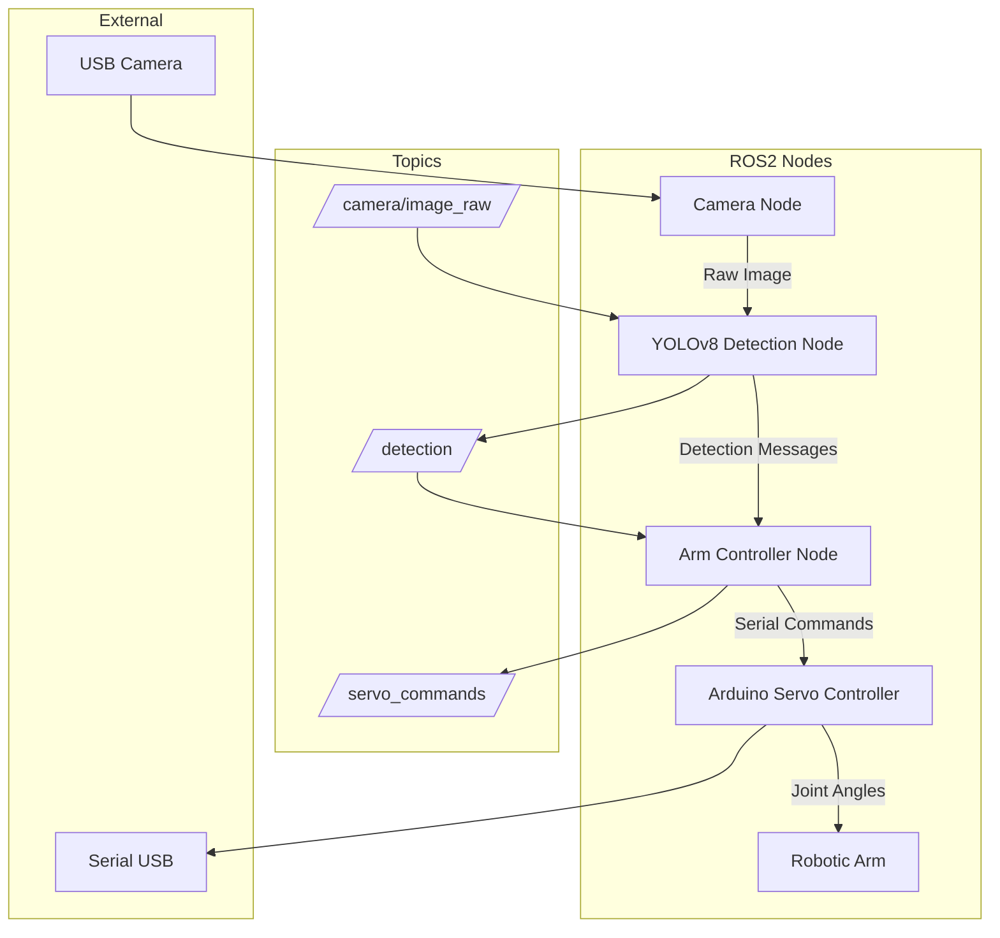

# ROS2 Integration Plan for Strawberry Picker

## Objective
Create ROS2 packages that integrate strawberry detection with robotic arm control, enabling automated picking.

## System Architecture



## Components

### 1. Existing `yolov8_cam` Package
- Publishes detection messages on `/detection` topic (JSON format)
- Publishes annotated images on `/yolov8_detected_image`
- Uses YOLOv8 model for strawberry detection

### 2. New `strawberry_picker_control` Package
- Subscribes to `/detection` topic
- Processes detection to select target strawberry (ripe, highest confidence)
- Converts pixel coordinates to robot workspace coordinates (requires calibration)
- Computes inverse kinematics to get joint angles
- Sends joint angles to Arduino via serial communication
- Implements picking sequence (approach, grip, retract)

### 3. Arduino Firmware (Existing)
- Receives serial commands (e.g., `I x y z` for inverse kinematics)
- Moves servos to target angles using smooth interpolation
- Returns status feedback

## Detailed Steps

### Step 1: Copy `yolov8_cam` Package
Create a new package `strawberry_picker_control` by copying the existing package structure and modifying it for control purposes.

### Step 2: Create Arm Controller Node
- Node name: `arm_controller`
- Subscribes to `/detection` (std_msgs/String)
- Parses JSON to get bounding boxes and class
- Filters for ripe strawberries (class "RipeStrawberry")
- Selects the strawberry closest to center or highest confidence
- Converts pixel coordinates (normalized 0-1) to robot coordinates (x, y, z) using a simple linear mapping (calibration needed)
- Calls inverse kinematics service or computes locally (if simple)
- Publishes servo commands to `/servo_commands` (custom message) or sends serial directly

### Step 3: Coordinate Transformation
We need a mapping from camera pixel space to robot workspace. This can be done via a calibration routine (not in scope). For now, assume a linear mapping:
- Camera resolution: 640x480
- Robot workspace: X: -10cm to +10cm, Y: 0cm to 20cm, Z: fixed height
- Use homography or simple scaling.

### Step 4: Serial Communication with Arduino
- Use `pyserial` to send commands like `I x y z` (inverse kinematics) or `F t0 t1 t2` (forward kinematics)
- Wait for Arduino response before proceeding.

### Step 5: Picking Sequence
1. Move to pre‑pick position (above strawberry)
2. Lower gripper to strawberry height
3. Close gripper
4. Lift strawberry
5. Move to drop location
6. Open gripper
7. Return to home position

### Step 6: Launch File
Create a launch file that starts:
- `yolov8_cam` node (detection)
- `arm_controller` node
- Optional: `webcam_server` if using HTTP stream

## Package Structure

```
strawberry_picker_control/
├── package.xml
├── setup.py
├── setup.cfg
├── resource/
├── test/
└── strawberry_picker_control/
    ├── __init__.py
    ├── arm_controller_node.py
    ├── coordinate_transformer.py
    ├── serial_interface.py
    ├── picking_sequence.py
    └── launch/
        └── picker.launch.py
```

## Dependencies
- `rclpy`
- `std_msgs`
- `sensor_msgs`
- `cv_bridge`
- `ultralytics` (for detection, but we can rely on existing node)
- `pyserial`

## Testing Strategy
1. Simulate detection with a mock publisher.
2. Test coordinate transformation with known points.
3. Test serial communication with Arduino using dummy commands.
4. Integrate step‑by‑step and run full picking sequence with a dummy strawberry.

## Next Steps
1. Copy the `yolov8_cam` package to `strawberry_picker_control`.
2. Implement the arm controller node.
3. Integrate with Arduino serial.
4. Create launch file.
5. Document usage.

## Questions for User
- Should we keep the detection node separate or merge into a single node?
- What is the serial port path for Arduino? (e.g., `/dev/ttyACM0`)
- Do you have a calibration procedure for camera‑robot mapping?
- Should we add a service for manual control (e.g., move to coordinates)?
- Do you want to include ripeness classification (already in detection) or just detection?

## Timeline
- Step 1‑2: 1 day
- Step 3‑4: 1 day
- Step 5‑6: 1 day
- Testing and refinement: 2 days

Let me know if this plan aligns with your expectations. I'll proceed with implementation after your approval.